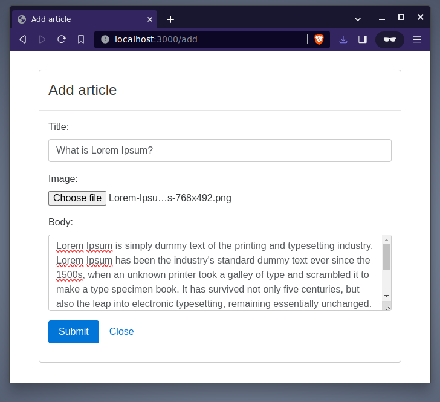
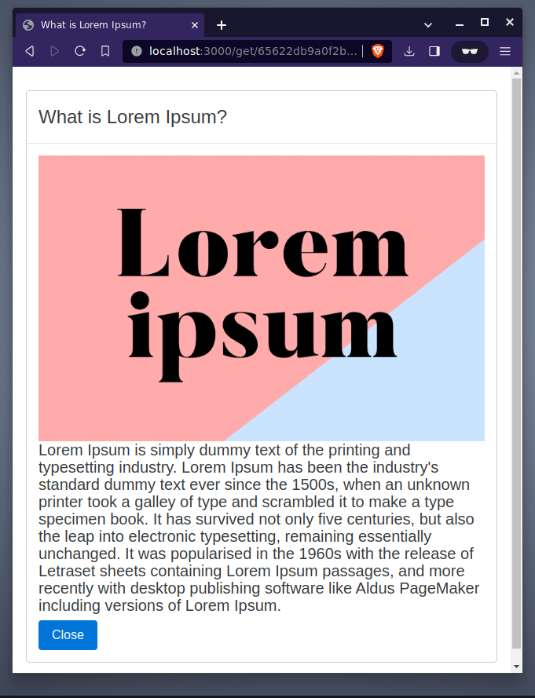
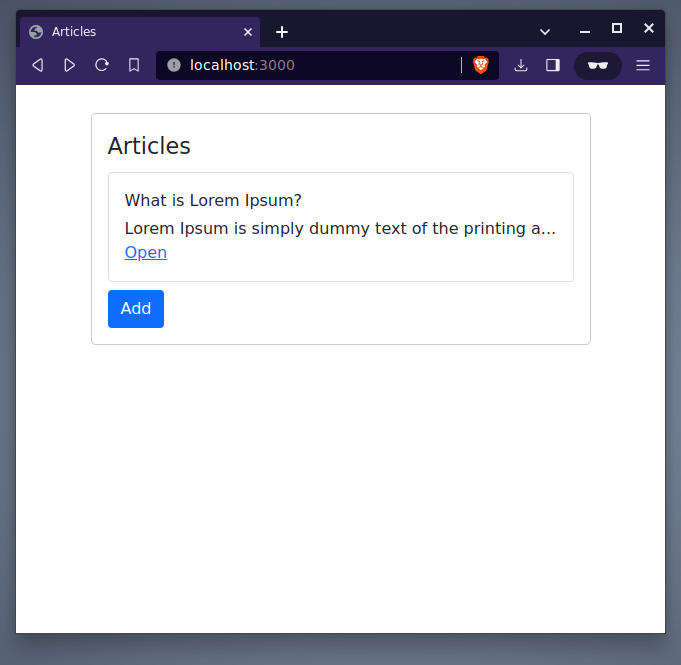

# Articles

Add, View, List articles.

[Screenshots](#screenshots)

## Built With
- [Node.js](https://nodejs.org/en/)
- [Express.js](https://expressjs.com/)
- [MongoDB](https://www.mongodb.com/)
- [Pug view engine](https://pugjs.org/)
- [Bootstrap css](https://getbootstrap.com/docs/3.4/css/)
- [Formidable](https://www.npmjs.com/package/formidable)

## Getting Started
To get you started you can simply clone the repository:

```
git clone https://github.com/SatyaSnehith/Articles-nodejs
```
and install the dependencies
```
npm install
```

### Prerequisites
You need git to clone the repository. You can get git from
[http://git-scm.com/](http://git-scm.com/).

A number of node.js tools is necessary to initialize and test the project. You must have node.js and its package manager (npm) installed. You can get them from  [http://nodejs.org/](http://nodejs.org/). The tools/modules used in this project are listed in package.json and include express, mongodb and mongoose.

#### MongoDB
The project uses MongoDB as a database. [Link](https://www.mongodb.com/docs/manual/administration/install-community/)

### Run the Application

The project is preconfigured with a simple development web server. The simplest way to start this server is:

    npm start

### Screenshots



